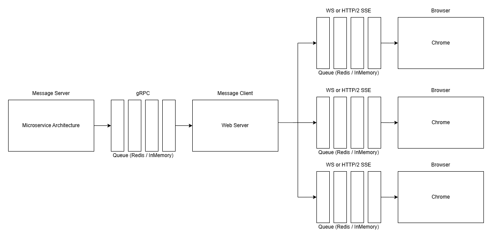
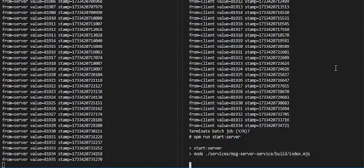
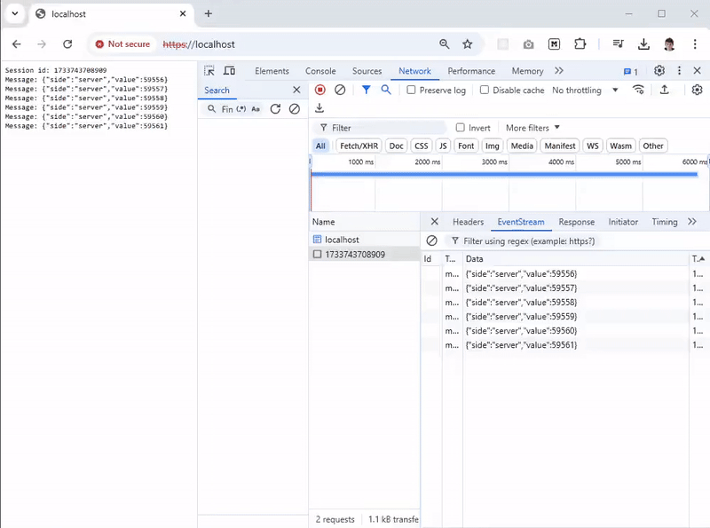
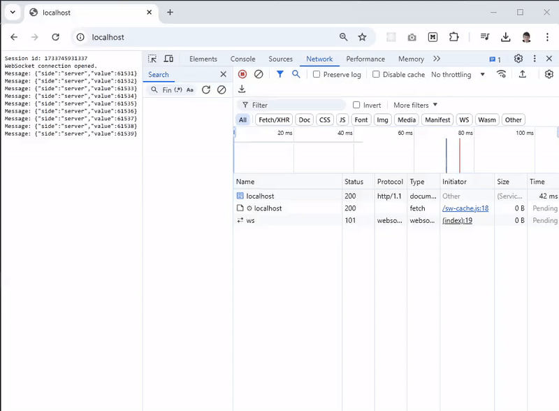

# 🔥 node-grpc-stream-queue

> Enables reliable bidirectional gRPC streaming with automatic retries, message queuing, error handling, and logging, supporting real-time communication between distributed services in a robust and fault-tolerant manner.



While the server or the client offline, the message buffering to the queue. After reconnect, all of them will be senden in the order of emit. The architecture expect each part of the chain can be restarted separately. Also, when you need, that software design allows to attach the queue to the Redis which will make system to restore it's state even after complete shut down

## Test case 1: console-grpc-streaming

> Console apps which stream events to each other through gRPC



**Setup**

```bash
npm install
npm run build
cd modules/remote-redis/docker
docker-compose up -d
```

**Running**

```bash
npm run start:msg-client
npm run start:msg-server
```

## Test case 2: sse-grpc-streaming

> HTTP/2 Server-Sent Events frontend app which recieves messages from gRPC service (**Require HTTPS**)



**Setup**

```bash
npm install
npm run build
mkdir ssl
cd ssl
mkcert localhost # choco install mkcert
cd modules/remote-redis/docker
docker-compose up -d
```

**Running**

```bash
npm run start:msg-server
npm run start:host-sse
npx -y open-cli https://localhost
```

## Test case 3 ws-grpc-streaming

> WebSocket frontend app which recieves messages from gRPC service (**HTTPS/HTTP**)



**Setup**

```bash
npm install
npm run build
cd modules/remote-redis/docker
docker-compose up -d
```

**Running**

```bash
npm run start:msg-server
npm run start:host-ws
npx -y open-cli http://localhost
```
